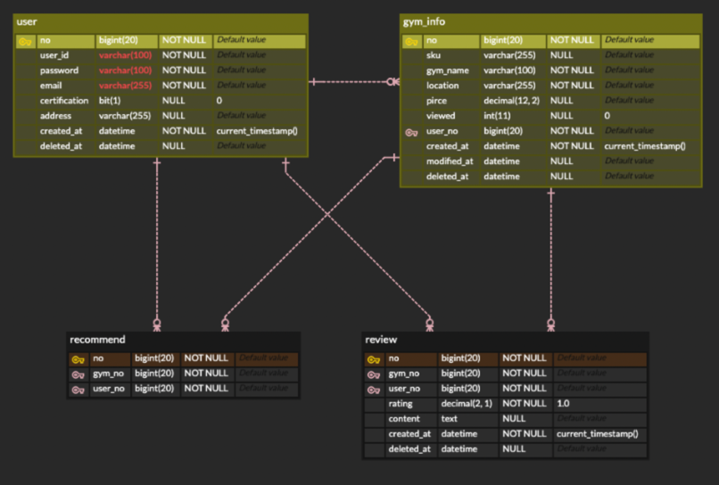

# Information

`짐-티켓`은 `피트니스 센터 일권 정보 공유 서비스`를 제공합니다. 
국내 여행 중이나 명절 등 타지에서 피트니스 센터를 이용하고자 할때 
직접 연락을 해보거나 온라인 상에서 일권 정보를 찾아봐야 하는 번거로움이 있습니다.
이와 같은 애로사항을 해결하기 위해 `짐-티켓`은 전국에 있는 헬스장 일권에 대한 정보를
모을 수 있도록 사용하는 유저가 자유롭게 올릴 수 있는 서비스를 구현하고 있습니다.

# Project

* 일정: `2023. 1. 14 ~`
* Architecture: `REST API 통신`
* Response Data Type: `JSON`
* API Docs: `Swagger`
* `SpringBoot 2.7.7`
* `Gradle`
* `Java 8`
* `Test Database: h2`
* `Database: MySQL`
* `Spring-Data-JPA`

# ERD

# Patch Note

